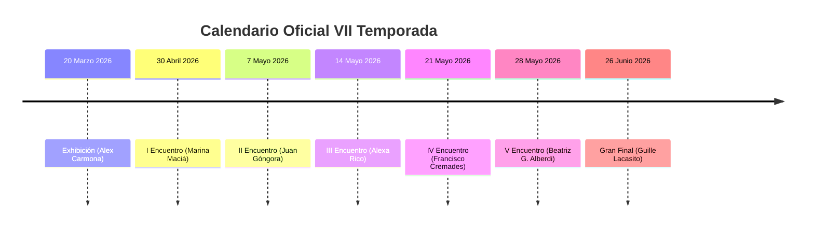

# INFORME HISTÓRICO Y REGISTRO COMPLETO — POETRY SLAM ALICANTE
**VII TEMPORADA (2025–2026)**

* **Destinataria:** Ágora Reix (Dirección, Coordinación Pedagógica y Conducción Oficial).
* **Fecha de consolidación:** 15 de Septiembre de 2026.
* **Fuente de datos:** Base de datos de producción Supabase (`wyrzkczhtwvaylgavjaq.supabase.co`).
* **Sedes oficiales:** Caja Negra y Casa de la Música — Centro Cultural Las Cigarreras (Alicante).

---

## 1. Resumen Ejecutivo y Métricas de Participación

Durante la VII Temporada, la plataforma interactiva de votación en directo registró una afluencia y fidelidad histórica por parte del público alicantino:

| Métrica Global | Cifra Oficial | Detalle / Observaciones |
| :--- | :---: | :--- |
| **Votos Totales Registrados** | **2.401** | Votos válidos emitidos por el público en sala desde el móvil |
| **Pines / Credenciales Emitidas** | **636** | Códigos de acceso seguros expedidos para jurado popular |
| **Poetas Participantes Únicos** | **33** | Poetas que subieron al escenario a competir |
| **Encuentros Oficiales** | **7** | 1 Exhibición + 5 Rondas clasificatorias + 1 Gran Final |
| **Carteles Oficiales en Archivo** | **12** | Diseños y carteles originales alojados en Storage Cloud |
| **Asistencia Máxima en Directo** | **> 200 personas** | Gran Final del 26 de junio en Casa de la Música (~100 votos/poeta) |

---

## 2. Cuadro de Honor — VII Temporada 2026

### 🏆 Campeón Oficial de la VII Temporada
* **GUILLE LACASITO** (Laurel de Oro)
  * **Distinción:** Campeón de Poetry Slam Alicante VII Edición.
  * **Pase Oficial:** Representante oficial de Alicante en el **Campeonato Nacional de Poetry Slam España** en Cartagena.
  * **Puntuación en la Gran Final:** 8.25 / 10 (Ronda 3, 81 votos emitidos).

### 🥈 Subcampeón de la Temporada
* **FRANCISCO COBOS** (Pluma de Plata)
  * **Puntuación en la Gran Final:** 5.27 / 10 (Ronda 3, 82 votos emitidos).

### 🥉 Tercer Puesto de la Temporada
* **ALFONSO PASO** (Lira de Bronce)
  * **Puntuación en la Gran Final:** 6.72 / 10 (Ronda 3, 25 votos emitidos).

---

## 3. Ficha Detallada de Cada Encuentro Oficial

---

### Velada 0: Exhibición Poetry Slam Alicante
* **Fecha:** 20 de marzo de 2026 | 17:00 h
* **Sede:** Centro Cultural Las Cigarreras
* **Presentadora:** Ágora Reix
* **Votos registrados:** 210 votos (35 votantes simultáneos)
* **Cartel oficial:** [Ver Cartel HD](https://wyrzkczhtwvaylgavjaq.supabase.co/storage/v1/object/public/carteles/1776100417972.jpeg)
* **Clasificación final:**
  1. 🥇 **Alex Carmona** — Media: **9.17** (35 votos)
  2. 🥈 **Marina Maciá** — Media: **6.66** (35 votos)
  3. 🥉 **Nando Arroyo** — Media: **6.51** (35 votos)
  4. Juan Góngora — Media: 6.29 (35 votos)
  5. Lucía Ros — Media: 6.11 (35 votos)
  6. Francisca Ossa — Media: 6.09 (35 votos)

---

### I Encuentro — VII Poetry Slam Alicante (Inauguración)
* **Fecha:** 30 de abril de 2026 | 20:00 h
* **Sede:** Caja Negra, Las Cigarreras Centro Cultural
* **Presentadora:** Ágora Reix
* **Voz invitada:** Francisca Ossa (*Disastro*, Campeona 2025)
* **Votos registrados:** 339 votos en sala
* **Cartel oficial:** [Ver Cartel HD](https://wyrzkczhtwvaylgavjaq.supabase.co/storage/v1/object/public/carteles/1777236711643.jpeg)
* **Poetas en escena (7):** Josan Canicio, María Lidón, Marina Maciá, Eliana Ollarve, Jessika Paola, Lydia Rico, Carlos Rodríguez.
* **Resultados Ronda Clasificatoria (Ronda 1):**
  1. Marina Maciá — Media: 8.40 (35 votos) *(Clasificada a Final)*
  2. Lydia Rico — Media: 7.83 (35 votos) *(Clasificada a Final)*
  3. Eliana Ollarve — Media: 5.61 (36 votos) *(Clasificada a Final)*
  4. Jessika Paola — Media: 6.00 (28 votos)
  5. Josan Canicio — Media: 5.39 (33 votos)
  6. Carlos Rodríguez — Media: 4.63 (32 votos)
  7. María Lidón — Media: 4.55 (33 votos)
* **Podio de Honor (Ronda 2 - Final):**
  * 🥇 **Laurel de Oro (Ganadora): MARINA MACIÁ** — Media: **7.46** (37 votos)
  * 🥈 **Pluma de Plata:** **Lydia Rico** — Media: **7.09** (35 votos)
  * 🥉 **Lira de Bronce:** **Eliana Ollarve** — Media: **5.54** (35 votos)

---

### II Encuentro — VII Poetry Slam Alicante
* **Fecha:** 7 de mayo de 2026 | 20:00 h
* **Sede:** Caja Negra, Las Cigarreras Centro Cultural
* **Presentadora:** Ágora Reix
* **Voz invitada:** José Luis Rico (Cantautor y poeta)
* **Votos registrados:** 180 votos en sala
* **Cartel oficial:** [Ver Cartel HD](https://wyrzkczhtwvaylgavjaq.supabase.co/storage/v1/object/public/carteles/1777578437505.jpeg)
* **Poetas en escena (6):** Mª Pilar Galdón, Juan Góngora, Jordi Más, Pedro Nso, Jean Pierre, Francis Torregrosa.
* **Resultados Ronda Clasificatoria (Ronda 1):**
  1. Juan Góngora — Media: 6.45 (22 votos) *(Clasificado a Final)*
  2. Jordi Más — Media: 6.30 (20 votos) *(Clasificado a Final)*
  3. Pedro Nso — Media: 5.73 (22 votos) *(Clasificado a Final)*
  4. Jean Pierre — Media: 4.36 (22 votos)
  5. Mª Pilar Galdón — Media: 4.00 (21 votos)
  6. Francis Torregrosa — Media: 3.50 (20 votos)
* **Podio de Honor (Ronda 2 - Final):**
  * 🥇 **Laurel de Oro (Ganador): JUAN GÓNGORA** — Media: **7.79** (19 votos)
  * 🥈 **Pluma de Plata:** **Jordi Más** — Media: **7.25** (16 votos)
  * 🥉 **Lira de Bronce:** **Pedro Nso** — Media: **6.44** (18 votos)

---

### III Encuentro — VII Poetry Slam Alicante
* **Fecha:** 14 de mayo de 2026 | 20:00 h
* **Sede:** Caja Negra, Las Cigarreras Centro Cultural
* **Presentadora:** Ágora Reix
* **Voz invitada:** Dúo Trascendental (Atmósferas sonoras y poesía)
* **Cartel oficial:** [Ver Cartel HD](https://wyrzkczhtwvaylgavjaq.supabase.co/storage/v1/object/public/carteles/1778247986695.jpeg)
* **Poetas en escena (7):** Antonio Beneite, Francisco Cobos, Mar Domenech, Pablo Ferrando, Laura Gómez, Lautaro Marrero, Alexa Rico.
* **Podio de Honor Oficial:**
  * 🥇 **Laurel de Oro (Ganadora): ALEXA RICO**
  * 🥈 **Pluma de Plata:** **Mar Domenech**
  * 🥉 **Lira de Bronce:** **Antonio Beneite**

---

### IV Encuentro — VII Poetry Slam Alicante
* **Fecha:** 21 de mayo de 2026 | 20:00 h
* **Sede:** Caja Negra, Las Cigarreras Centro Cultural
* **Presentadora:** Ágora Reix
* **Voz invitada:** Troppo Lírica (Sátira y humor escénico)
* **Votos registrados:** 160 votos en sala
* **Credenciales emitidas:** 132
* **Cartel oficial:** [Ver Cartel HD](https://wyrzkczhtwvaylgavjaq.supabase.co/storage/v1/object/public/carteles/1779294681111.jpeg)
* **Poetas en escena (7):** Francisco Cremades, Rosa Estomba, Isabel Guiu, Guille Lacasito, Margo, Cristina Molina, Alfonso Paso.
* **Resultados Ronda Clasificatoria (Ronda 1):**
  1. Alfonso Paso — Media: 8.12 (17 votos)
  2. Guille Lacasito — Media: 7.53 (17 votos)
  3. Cristina Molina — Media: 6.94 (17 votos)
  4. Rosa Estomba — Media: 6.46 (13 votos)
  5. Isabel Guiu — Media: 5.18 (17 votos)
  6. Margo — Media: 4.50 (12 votos)
  7. Francisco Cremades — Media: 3.73 (15 votos)
* **Podio de Honor Oficial (Final):**
  * 🥇 **Laurel de Oro (Ganador): FRANCISCO CREMADES**
  * 🥈 **Pluma de Plata:** **Alfonso Paso**
  * 🥉 **Lira de Bronce:** **Guille Lacasito**

---

### V Encuentro — VII Poetry Slam Alicante
* **Fecha:** 28 de mayo de 2026 | 20:00 h
* **Sede:** Caja Negra, Las Cigarreras Centro Cultural
* **Presentadora:** Ágora Reix
* **Voz invitada:** Vera Lu & Claudio H (Guitarra y voz lírica)
* **Votos registrados:** 294 votos en sala
* **Credenciales emitidas:** 132
* **Cartel oficial:** [Ver Cartel HD](https://wyrzkczhtwvaylgavjaq.supabase.co/storage/v1/object/public/carteles/1779973992600.jpeg)
* **Poetas en escena (7 competidores + demo):** Nando Arroyo, Cristian Burgos, Varinia Casati, Jose Gutiérrez, Beatriz G. Alberdi, Iris Marmol, Raquel Sánchez.
* **Resultados Ronda Clasificatoria (Ronda 2 de competición):**
  1. Beatriz G. Alberdi — Media: 9.04 (27 votos) *(Clasificada a Final)*
  2. Nando Arroyo — Media: 7.07 (28 votos) *(Clasificado a Final)*
  3. Raquel Sánchez — Media: 6.44 (27 votos) *(Clasificada a Final)*
  4. Varinia Casati — Media: 5.70 (27 votos)
  5. Cristian Burgos — Media: 4.86 (28 votos)
  6. Jose Gutiérrez — Media: 4.79 (28 votos)
  7. Iris Marmol — Media: 4.44 (27 votos)
* **Podio de Honor (Ronda 3 - Final a tres):**
  * 🥇 **Laurel de Oro (Ganadora): BEATRIZ G. ALBERDI** — Media: **9.00** (24 votos)
  * 🥈 **Pluma de Plata:** **Nando Arroyo** — Media: **7.68** (25 votos)
  * 🥉 **Lira de Bronce:** **Raquel Sánchez** — Media: **6.00** (24 votos)

---

### Gran Final — VII Poetry Slam Alicante (26 Junio 2026)
* **Fecha:** 26 de junio de 2026 | 20:00 h
* **Sede:** Casa de la Música, Las Cigarreras Centro Cultural
* **Presentadora:** Ágora Reix
* **Aforo:** Completo (> 200 personas)
* **Votos registrados:** **1.203 votos**
* **Credenciales de voto emitidas:** 240
* **Cartel oficial:** [Ver Cartel HD](https://wyrzkczhtwvaylgavjaq.supabase.co/storage/v1/object/public/carteles/1782495887466.png)
* **Los 11 Poetas Clasificados en Escena:**
  * Nando Arroyo, Francisco Cobos, Laura Gómez, Juan Góngora, Beatriz G. Alberdi, Guille Lacasito, Marina Maciá, Jordi Más, Pedro Nso, Lydia Rico, Alfonso Paso.

#### Resultados Ronda Semifinal (Ronda 2 en sistema, ~95 votos por poeta):
1. **Guille Lacasito** — Media: **7.30** (92 votos) *(Clasificado a Ronda Final)*
2. **Alfonso Paso** — Media: **7.06** (96 votos) *(Clasificado a Ronda Final)*
3. **Francisco Cobos** — Media: **5.85** (95 votos) *(Clasificado a Ronda Final)*
4. Jordi Más — Media: 6.07 (91 votos)
5. Nando Arroyo — Media: 5.71 (91 votos)
6. Beatriz G. Alberdi — Media: 5.69 (91 votos)
7. Marina Maciá — Media: 5.64 (94 votos)
8. Lydia Rico — Media: 5.54 (92 votos)
9. Juan Góngora — Media: 5.27 (91 votos)
10. Laura Gómez — Media: 4.79 (96 votos)

#### Gran Final a Tres (Ronda 3 - Decisión de Temporada):
* 🥇 **CAMPEÓN DE LA VII TEMPORADA: GUILLE LACASITO**
  * Puntuación: **8.25** (81 votos)
  * **Laurel de Oro y Representante Oficial de Alicante en el Campeonato de España (Cartagena 2026)**
* 🥈 **SUBCAMPEÓN: FRANCISCO COBOS**
  * Puntuación: **5.27** (82 votos)
  * **Pluma de Plata**
* 🥉 **TERCER CLASIFICADO: ALFONSO PASO**
  * Puntuación: **6.72** (25 votos)
  * **Lira de Bronce**

---

## 4. Clasificación y Palmarés Acumulado de Poetas

Listado de poetas con mayor presencia y éxitos en la VII Temporada:

| Poeta | Encuentros Disputados | Victorias (Laurel de Oro) | Finales Alcanzadas | Destacados / Hitos |
| :--- | :---: | :---: | :---: | :--- |
| **Guille Lacasito** | 2 | **1** | 2 | **Campeón de la Temporada 2026**, 3º en IV Encuentro |
| **Marina Maciá** | 3 | **1** | 2 | Ganadora I Encuentro, 2ª en Exhibición, Finalista Temporada |
| **Beatriz G. Alberdi** | 2 | **1** | 2 | Ganadora V Encuentro (con nota 9.04), Finalista Temporada |
| **Juan Góngora** | 3 | **1** | 2 | Ganador II Encuentro, 4º en Exhibición, Finalista Temporada |
| **Alexa Rico** | 1 | **1** | 1 | Ganadora III Encuentro |
| **Francisco Cremades** | 1 | **1** | 1 | Ganador IV Encuentro |
| **Alex Carmona** | 1 | **1** | 1 | Ganador Velada Exhibición (nota 9.17) |
| **Alfonso Paso** | 2 | 0 | 2 | Subcampeón IV Encuentro, 3º en Gran Final |
| **Francisco Cobos** | 2 | 0 | 1 | **Subcampeón de la Temporada 2026** |
| **Nando Arroyo** | 3 | 0 | 2 | Subcampeón V Encuentro, 3º en Exhibición |
| **Lydia Rico** | 2 | 0 | 2 | Subcampeona I Encuentro, Finalista Temporada |
| **Jordi Más** | 2 | 0 | 1 | Subcampeón II Encuentro, 4º en Semifinal de Temporada |
| **Mar Domenech** | 1 | 0 | 1 | Subcampeona III Encuentro |
| **Pedro Nso** | 2 | 0 | 1 | 3º en II Encuentro, Finalista Temporada |
| **Raquel Sánchez** | 1 | 0 | 1 | 3ª en V Encuentro |
| **Eliana Ollarve** | 1 | 0 | 1 | 3ª en I Encuentro |
| **Antonio Beneite** | 1 | 0 | 1 | 3º en III Encuentro |
| **Laura Gómez** | 2 | 0 | 0 | Participante en III Encuentro y Gran Final |

---

## 5. Repositorio de Archivos y Carteles en Supabase Storage

Todos los carteles originales de alta resolución están salvaguardados en el bucket `carteles`:

| Archivo | Enlace Directo | Descripción |
| :--- | :--- | :--- |
| `1776093019285.png` | [Abrir Imagen](https://wyrzkczhtwvaylgavjaq.supabase.co/storage/v1/object/public/carteles/1776093019285.png) | Cartel Oficial General VII Temporada (4.2 MB) |
| `1776100417972.jpeg` | [Abrir Imagen](https://wyrzkczhtwvaylgavjaq.supabase.co/storage/v1/object/public/carteles/1776100417972.jpeg) | Cartel Exhibición Marzo 2026 |
| `1777236711643.jpeg` | [Abrir Imagen](https://wyrzkczhtwvaylgavjaq.supabase.co/storage/v1/object/public/carteles/1777236711643.jpeg) | Cartel I Encuentro (Francisca Ossa) |
| `1777578437505.jpeg` | [Abrir Imagen](https://wyrzkczhtwvaylgavjaq.supabase.co/storage/v1/object/public/carteles/1777578437505.jpeg) | Cartel II Encuentro (José Luis Rico) |
| `1778247986695.jpeg` | [Abrir Imagen](https://wyrzkczhtwvaylgavjaq.supabase.co/storage/v1/object/public/carteles/1778247986695.jpeg) | Cartel III Encuentro (Dúo Trascendental) |
| `1779294681111.jpeg` | [Abrir Imagen](https://wyrzkczhtwvaylgavjaq.supabase.co/storage/v1/object/public/carteles/1779294681111.jpeg) | Cartel IV Encuentro (Troppo Lírica) |
| `1779973992600.jpeg` | [Abrir Imagen](https://wyrzkczhtwvaylgavjaq.supabase.co/storage/v1/object/public/carteles/1779973992600.jpeg) | Cartel V Encuentro (Vera Lu & Claudio H) |
| `1782495887466.png` | [Abrir Imagen](https://wyrzkczhtwvaylgavjaq.supabase.co/storage/v1/object/public/carteles/1782495887466.png) | Cartel Oficial Gran Final 26 Junio en Casa de la Música (3.4 MB) |

---

## 6. Archivos Exportados Listos para Entrega

Se han generado 3 ficheros listos para enviar a Ágora Reix o abrir en Microsoft Excel, Numbers o Google Sheets:

1. 📄 **`resumen_eventos_y_ganadores.csv`**:
   - Tabla con cada edición, fecha, sede, presentadora, artista invitado, podio completo (ganador, 2º, 3º), recuento de participantes y votos.
2. 📊 **`clasificacion_general_poetas.csv`**:
   - Hoja de cálculo con todos los poetas, número de apariciones, victorias, finales y eventos disputados.
3. 💾 **`datos_completos_poetry_slam_alicante.json`**:
   - Archivo JSON estructurado con el volcado íntegro de Supabase, metadatos, rankings y enlaces directos a la nube.
