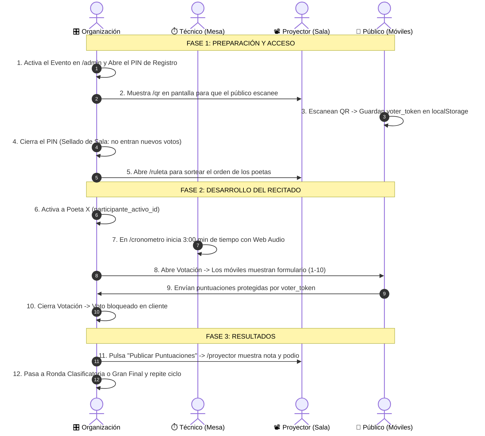

# 🎤 POETRY SLAM ALICANTE — PLATAFORMA INTEGRAL DE COMPETICIÓN EN DIRECTO

> Plataforma web de alto rendimiento para la gestión, votación popular en tiempo real, cronometraje oficial, ruleta de sorteo y proyección de los encuentros de poesía en vivo del **Poetry Slam Alicante**.

---

## 📑 ÍNDICE DE CONTENIDOS

1. [Visión y Propósito del Proyecto](#-visión-y-propósito-del-proyecto)
2. [Arquitectura General y Diagrama de Conexiones](#-arquitectura-general-y-diagrama-de-conexiones)
3. [Flujo Operativo de un Poetry Slam (Paso a Paso)](#-flujo-operativo-de-un-poetry-slam-paso-a-paso)
4. [Desglose Técnico Componente por Componente](#-desglose-técnico-componente-por-componente)
   - [4.1 Núcleo de la Aplicación y Shell Global](#41-núcleo-de-la-aplicación-y-shell-global)
   - [4.2 Portal Público y Divulgación](#42-portal-público-y-divulgación)
   - [4.3 Sistema de Autenticación y Seguridad](#43-sistema-de-autenticación-y-seguridad)
   - [4.4 Panel de Administración y Control](#44-panel-de-administración-y-control)
   - [4.5 Herramientas de Escenario en Vivo](#45-herramientas-de-escenario-en-vivo)
   - [4.6 Motor de Votación y Proyección en Sala](#46-motor-de-votación-y-proyección-en-sala)
5. [Capa de Servicios Reactivos (`src/app/core/services`)](#-capa-de-servicios-reactivos)
6. [Modelo de Datos y Supabase Realtime](#-modelo-de-datos-y-supabase-realtime)
7. [Sistema de Diseño Teatral (*Cyber-Stage Design System*)](#-sistema-de-diseño-teatral-cyber-stage)
8. [Instalación, Variables de Entorno y Despliegue](#-instalación-variables-de-entorno-y-despliegue)

---

## 🎯 VISIÓN Y PROPÓSITO DEL PROYECTO

El **Poetry Slam** es un formato escénico y competitivo donde poetas disponen de 3 minutos para recitar sus textos sin atrezo ni música, siendo calificados directamente por el público asistente.

Esta plataforma digitaliza y centraliza todo el ciclo de vida de la temporada:
- **Público:** Votación interactiva desde su móvil mediante escaneo de QR exclusivo o código de acceso seguro, sin registro previo y con protección contra votos duplicados.
- **Presentador / Organización:** Panel de control en vivo para activar poetas uno a uno, abrir/cerrar votaciones, gestionar rondas (*La Quema*, *Clasificatoria*, *Gran Final*), sortear orden con ruleta física y proyectar resultados.
- **Mesa Técnica:** Cronómetro oficial sincronizado con penalizaciones automáticas por segundo y alertas sonoras mediante la Web Audio API.

---

## 🏗️ ARQUITECTURA GENERAL Y DIAGRAMA DE CONEXIONES

La aplicación está construida como una **Single Page Application (SPA)** reactiva con **Angular 18**, comunicada bidireccionalmente con **Supabase** (PostgreSQL, Realtime WebSockets, Auth y Storage).

```
 ┌────────────────────────────────────────────────────────────────────────────────────────┐
 │                                   APLICACIÓN CLIENTE (SPA)                             │
 │                                                                                        │
 │  ┌─────────────────────────────────┐           ┌────────────────────────────────────┐  │
 │  │        PÚBLICO / ASISTENTES     │           │      ORGANIZACIÓN / TÉCNICOS       │  │
 │  │  • /votar (Móvil)               │           │  • /admin (Panel de Control Live)  │  │
 │  │  • /calendario, /cantera        │           │  • /cronometro (Medición oficial)  │  │
 │  │  • /normas, / (Inicio)          │           │  • /ruleta (Sorteo aleatorio)      │  │
 │  └────────────────┬────────────────┘           │  • /proyector (Pantalla gigante)   │  │
 │                   │                            └─────────────────┬──────────────────┘  │
 │                   │                                              │                     │
 │                   ▼                                              ▼                     │
 │  ┌──────────────────────────────────────────────────────────────────────────────────┐  │
 │  │                     CAPA DE SERVICIOS REACTIVOS SINGLETON (RxJS)                 │  │
 │  │   EventosService │ VotacionesService │ AuthService │ ThemeService │ SeoService   │  │
 │  └──────────────────────────────────────────┬───────────────────────────────────────┘  │
 └─────────────────────────────────────────────┼──────────────────────────────────────────┘
                                               │ (HTTPS REST + WSS Realtime)
                                               ▼
 ┌────────────────────────────────────────────────────────────────────────────────────────┐
 │                                  BACKEND SUPABASE (CLOUD)                              │
 │                                                                                        │
 │   ┌──────────────────────────┐  ┌─────────────────────────┐  ┌─────────────────────┐   │
 │   │  PostgreSQL Database     │  │  Realtime Engine (WSS)  │  │  Supabase Auth      │   │
 │   │  • eventos               │  │  • postgres_changes     │  │  • JWT tokens       │   │
 │   │  • participantes         │  │    (eventos, votos,     │  │  • Role: Admin      │   │
 │   │  • votos                 │  │     participantes)      │  │  • AuthGuard        │   │
 │   │  • cronograma            │  │                         │  │  • GuestGuard       │   │
 │   └──────────────────────────┘  └─────────────────────────┘  └─────────────────────┘   │
 └────────────────────────────────────────────────────────────────────────────────────────┘
```

---

## ⚡ FLUJO OPERATIVO DE UN POETRY SLAM (PASO A PASO)



---

## 🧩 DESGLOSE TÉCNICO COMPONENTE POR COMPONENTE

### 4.1 NÚCLEO DE LA APLICACIÓN Y SHELL GLOBAL

#### 🪶 `AppComponent` (`src/app/app.component.*`)
- **Ruta:** Raíz de la aplicación (`<app-root>`).
- **Rol:** Shell principal que orquesta la navegación, el avatar de la organización, el menú desplegable flotante, la sub-barra de control rápido y la inyección global de temas dinámicos.
- **Comportamiento Clave:**
  - **Avatar de la Pluma Poética (`avatar-quill.jpg`):** Se muestra en el header cuando `auth.session$` está activo. Al pulsar, abre un desplegable `.profile-dropdown.glass` con email, rol, accesos directos y botón de logout centralizado.
  - **Sub-Barra de Control Rápido (`.admin-quick-bar`):** Barra fija pegada bajo la cabecera cuando el usuario está autenticado, con accesos directos a *Panel General (`/admin`)*, *Proyector (`/proyector`)*, *Cronómetro (`/cronometro`)*, *Ruleta (`/ruleta`)*, *Puntuaciones (`/puntuaciones`)* y *Códigos QR (`/qr`)*.
  - **Listener Global de Clic (`@HostListener('document:click')`):** Cierra menús desplegables automáticamente al pulsar en cualquier lugar externo.
  - **Suscripción de Eventos:** Escucha cambios en `listenToAllEventosChanges()` para actualizar en tiempo real los botones contextuales de la barra (*Votar*, *Puntuaciones*, *QR*).

#### ⏳ `LoadingSpinnerComponent` (`src/app/shared/components/loading-spinner/`)
- **Selector:** `<app-loading-spinner>`
- **Inputs:** `@Input() fullScreen: boolean = false`
- **Comportamiento:** Renderiza la pluma poética de luz con rotación suave, auras de neón cian/lima y citas poéticas aleatorias (*"La poesía no busca la verdad, la crea"*, etc.). En `fullScreen="true"` se fija a `z-index: 99999` para cubrir toda la pantalla durante el login y transiciones críticas.

#### 🪟 `ModalComponent` (`src/app/shared/components/modal/`)
- **Selector:** `<app-modal>`
- **Inputs:** `@Input() title: string`
- **Outputs:** `@Output() close = new EventEmitter<void>()`
- **Comportamiento:** Ventana modal flotante con efecto glassmorphism, haz láser superior y cierre por botón o clic en el backdrop.

---

### 4.2 PORTAL PÚBLICO Y DIVULGACIÓN

#### 🏠 `LandingComponent` (`src/app/features/landing/landing/`)
- **Ruta:** `/`
- **Componentes Hijos:** `HeroSeasonComponent`, `HeroStaticComponent`
- **Comportamiento:**
  - Si hay una temporada o evento activo, muestra el cartel y fecha del próximo Slam.
  - Sección de las **3 Reglas Esenciales** (*3 Minutos, Texto Propio, Sin Atrezo*).
  - Bloque interactivo de exploración escénica con accesos a Calendario, Normas, Cantera y Cronómetro con fondo teatral fijo y viñeta abisal.

#### 📅 `CalendarComponent` (`src/app/features/landing/calendar/`)
- **Ruta:** `/calendario`
- **Servicio:** `CronogramaService`, `EventosService`
- **Comportamiento:** Lista todas las fechas oficiales de la temporada, ubicaciones (*Caja Negra Las Cigarreras*, etc.), estado (*Próximo / Finalizado*) y enlaces directos a compra de entradas en Entradium.

#### 🌱 `CanteraComponent` (`src/app/features/landing/cantera/`)
- **Ruta:** `/cantera`
- **Comportamiento:** Espacio dedicado a la formación de nuevas voces, talleres de Spoken Word y poetas emergentes. Diseño con fondo de escenario teatral y tarjeta translúcida de lectura.

#### 📜 `NormasComponent` (`src/app/features/landing/normas/`)
- **Ruta:** `/normas`
- **Comportamiento:** Reglamento oficial numerado en números romanos con tipografía Oswald y lectura protegida (`noindex, nofollow` para SEO).

---

### 4.3 SISTEMA DE AUTENTICACIÓN Y SEGURIDAD

#### 🔐 `LoginComponent` (`src/app/features/auth/login/`)
- **Ruta:** `/auth/login` (Protegida por `GuestGuard`)
- **Comportamiento:**
  - Fondo escénico fijo de cabina de control y mesa de mezclas con viñeta de ventana teatral (`login_hero.jpg`).
  - Tarjeta de 580px con haz de luz láser y glassmorphism.
  - Iconos vectoriales de correo y candado, con botón interactivo de visibilidad de contraseña (show/hide).
  - Desencadena `<app-loading-spinner [fullScreen]="true">` durante la llamada a `auth.signIn()`.

#### 🛡️ `AuthGuard` & `GuestGuard` (`src/app/core/guards/`)
- **`AuthGuard`:** Comprueba la sesión activa de Supabase antes de permitir el paso a `/admin`, `/admin/imprimir-qrs` y `/dashboard`. Redirige a `/auth/login` si no hay sesión.
- **`GuestGuard`:** Evita que administradores ya autenticados accedan a `/auth/login` o `/auth/register`, redirigiéndolos directamente al panel.

---

### 4.4 PANEL DE ADMINISTRACIÓN Y CONTROL

#### 🎛️ `AdminDashboardComponent` (`src/app/features/admin/admin-dashboard/`)
- **Ruta:** `/admin` (Protegida por `AuthGuard`)
- **Componentes Hijos:** `AdminTabsComponent`, `LiveControlComponent`, `EventListComponent`, `CronogramaListComponent`, `EventDetailComponent`
- **Comportamiento:**
  - Contenedor maestro con tarjeta `.glass` y haz de luz láser superior.
  - Control de vistas mediante la pestaña activa (`live`, `eventos`, `anteriores`, `temporada`).
  - Desacoplamiento total del formulario de creación y edición mediante modales.

#### 📋 `EventListComponent` (`src/app/features/admin/event-list/`)
- **Selector:** `<app-event-list>`
- **Inputs:** `@Input() mode: 'proximos' | 'anteriores'`
- **Comportamiento:**
  - Grid de tarjetas de eventos con título en Oswald y badges vectoriales SVG (*EN PORTADA, HISTORIAL, PRÓXIMO, VOTOS EN VIVO*).
  - Botón interactivo para fijar/desfijar de la portada de la web.
  - Toggle de apertura/cierre de votaciones con cambio reactivo de color.
  - Acceso directo a edición modal o control en directo.
  - Botón para abrir la vista de impresión de tarjetas QR.

#### 🔴 `LiveControlComponent` (`src/app/features/admin/event-detail/components/live-control/`)
- **Selector:** `<app-live-control>`
- **Comportamiento:**
  - **Barra de Rondas:** Selector de fase (*La Quema*, *Clasificatoria*, *Gran Final*) con transiciones guiadas por flechas SVG.
  - **Botones de Escenario:** Publicar/Ocultar Puntuaciones en el proyector, Cerrar Votos Rápidos, Ver Proyector en nueva pestaña y Bloquear/Abrir PIN de Registro QR.
  - **Control 1 a 1 de Poetas:** Lista de participantes con avatar, nombre e indicador luminoso de estado. Al hacer clic en *"Abrir Votación"*, el backend actualiza `participante_activo_id`, lo que hace que todos los dispositivos del público cambien al formulario de voto de ese poeta instantáneamente.
  - **Modal de Confirmación:** Para finalizar y archivar el evento protegiendo los datos históricos.

#### 🎨 `CronogramaListComponent` (`src/app/features/admin/cronograma-list/`)
- **Selector:** `<app-cronograma-list>`
- **Comportamiento:**
  - Carga y actualización de la imagen global de fondo de la temporada.
  - Configuración de la edición actual (*Ej: VII Edición*) y enlace a abonos de Entradium.
  - Editor interactivo de la paleta de colores de temporada (Primario, Secundario, Cabecera, Fondo, Texto).
  - Formulario de creación de eventos por lotes y eliminación de fechas con botón SVG.

#### 📝 `EventDetailComponent` (`src/app/features/admin/event-detail/`)
- **Selector:** `<app-event-detail>`
- **Componentes Hijos:** `EventBasicInfoComponent`, `EventThemeComponent`, `EventMediaComponent`, `EventParticipantsComponent`
- **Comportamiento:** Formulario reactivo (`FormGroup`) para editar nombre, fecha, hora, sede, colores personalizados del evento, subida de cartel y lista ordenada de poetas participantes.

#### 🖨️ `PrintQrsComponent` (`src/app/features/admin/print-qrs/`)
- **Ruta:** `/admin/imprimir-qrs/:eventoId`
- **Comportamiento:** Genera una plantilla A4 imprimible con tarjetas individuales numeradas, conteniendo cada una un código QR único con el token de votante (`voter_token`) preconfigurado para repartir al público.

---

### 4.5 HERRAMIENTAS DE ESCENARIO EN VIVO

#### ⏱️ `CronometroComponent` (`src/app/features/cronometro/`)
- **Ruta:** `/cronometro`
- **Comportamiento:**
  - Cronómetro de competición configurado a **3:00 minutos** de tiempo reglamentario.
  - **Cálculo Automático de Penalización:** Tras superar los 3:00, descuenta `-0.5 puntos` por cada bloque de 10 segundos excedidos (mostrado en rojo).
  - **Límite de Descalificación:** A los 3:30 minutos muestra aviso de descalificación automática.
  - **Web Audio API:** Generador de tonos y pitidos de aviso sonoro sintetizados sin depender de archivos de audio externos.
  - **Controles de Teclado:**
    - `Espacio`: Iniciar / Pausar.
    - `R`: Reiniciar tiempo.
    - `F`: Pantalla completa (*Fullscreen Mode*).

#### 🎡 `RuletaComponent` (`src/app/features/ruleta/`)
- **Ruta:** `/ruleta`
- **Comportamiento:**
  - Ruleta interactiva renderizada dinámicamente en un **Canvas 2D de HTML5**.
  - **Física Realista de Giro:** Aceleración angular, desaceleración con fricción, efecto de rebote en la aguja y selección aleatoria sin sesgo.
  - **Audio Sintetizado:** Efecto sonoro de clic en cada casilla mediante el oscilador de Web Audio API y fanfarria al detenerse.
  - **Efectos de Celebración:** Disparo de partículas de confetti sobre el canvas al proclamar el poeta seleccionado.
  - **Gestión de Nombres:** Permite escribir la lista de poetas manualmente o importarla del evento activo, con opción de eliminar al poeta ya sorteado.

---

### 4.6 MOTOR DE VOTACIÓN Y PROYECCIÓN EN SALA

#### 📱 `VotarComponent` (`src/app/features/votar/`)
- **Ruta:** `/votar`
- **Servicio:** `VotacionesService`, `EventosService`
- **Estados de la Máquina de Estados del Voto:**
  1. **Acceso Bloqueado:** Si el usuario no tiene token y el registro está cerrado (`registro_pin_abierto: false`).
  2. **Sin Votación Activa:** Si el evento aún no ha comenzado.
  3. **Esperando al Siguiente Poeta:** Si hay un recitado en curso pero aún no se han abierto las notas.
  4. **Formulario de Voto Activo:** Muestra avatar y nombre del poeta en escena (`participante_activo_id`), selector de puntuación de 1 a 10 con teclado táctil y botón de confirmación.
  5. **Voto Enviado con Éxito:** Muestra pantalla de confirmación y bloquea el botón para evitar duplicados. En cuanto el Admin activa al siguiente poeta, la suscripción Realtime detecta el nuevo ID y resetea el formulario automáticamente.

#### 📽️ `PuntuacionesComponent` (`src/app/features/puntuaciones/`)
- **Ruta:** `/puntuaciones` (o `/proyector`)
- **Comportamiento:**
  - Pantalla adaptada para proyector de sala con alto contraste, Oswald y visualización limpia.
  - Suscripción en tiempo real a la tabla `votos` y `eventos`.
  - Muestra la media calculada, descartando la nota más alta y la más baja si hay 5 jurados, o media ponderada global.
  - Modos de visualización: Podio de honor, clasificación en directo y desglose por rondas.

#### 📲 `QrComponent` (`src/app/features/qr/`)
- **Ruta:** `/qr`
- **Comportamiento:** Proyecta en pantalla gigante el código QR de acceso directo al evento activo con instrucciones para que el público escanee desde sus teléfonos móviles.

---

## 🛠️ CAPA DE SERVICIOS REACTIVOS

| Servicio | Archivo | Responsabilidad Principal |
| :--- | :--- | :--- |
| **`AuthService`** | `auth.service.ts` | Gestión de sesión con Supabase Auth (`session$`, `currentUser`, `signIn`, `signOut`). |
| **`EventosService`** | `eventos.service.ts` | CRUD de eventos, activación de poetas, flags de votación y suscripciones a canales Realtime (`listenToEventoChanges`). |
| **`ParticipantesService`** | `participantes.service.ts` | Gestión de poetas, orden de recitado, asignación a rondas y fotos de perfil. |
| **`VotacionesService`** | `votaciones.service.ts` | Registro de votos con validación de `voter_token`, cálculo de medias y auditoría de duplicados. |
| **`CronogramaService`** | `cronograma.service.ts` | Gestión de la temporada global, fechas y enlaces de venta de entradas. |
| **`ThemeService`** | `theme.service.ts` | Inyección dinámica de variables CSS (`--primary`, `--secondary`, `--bg`, etc.) según la paleta del evento o temporada. |
| **`SeoService`** | `seo.service.ts` | Modificación de `<title>`, `<meta name="description">`, OpenGraph y generación de esquemas JSON-LD. |
| **`SupabaseService`** | `supabase.service.ts` | Inicialización centralizada del cliente `@supabase/supabase-js`. |

---

## 🗄️ MODELO DE DATOS Y SUPABASE REALTIME

### Tablas Principales en PostgreSQL:

#### 1. `eventos`
```sql
create table eventos (
  id uuid primary key default uuid_generate_v4(),
  nombre text not null,
  fecha timestamp with time zone not null,
  ubicacion text,
  activo boolean default false,               -- Visible en portada
  votacion_activa boolean default false,       -- Votaciones habilitadas
  puntuaciones_activas boolean default false,  -- Publicadas en proyector
  registro_pin_abierto boolean default false,  -- Ventana de registro QR abierta
  participante_activo_id uuid references participantes(id), -- Poeta en escena
  color_primario text,
  color_secundario text,
  cartel_url text,
  created_at timestamp with time zone default now()
);
```

#### 2. `participantes`
```sql
create table participantes (
  id uuid primary key default uuid_generate_v4(),
  evento_id uuid references eventos(id) on delete cascade,
  nombre text not null,
  foto_url text,
  orden integer not null default 0,
  ronda integer not null default 1,            -- 1: Quema/Clasificatoria, 2: Final
  puntuacion_final numeric(4,2),
  created_at timestamp with time zone default now()
);
```

#### 3. `votos`
```sql
create table votos (
  id uuid primary key default uuid_generate_v4(),
  evento_id uuid references eventos(id) on delete cascade,
  participante_id uuid references participantes(id) on delete cascade,
  voter_token text not null,                   -- Identificador único del dispositivo
  puntuacion numeric(4,2) not null check (puntuacion between 1 and 10),
  created_at timestamp with time zone default now(),
  constraint unq_voto_participante_dispositivo unique(participante_id, voter_token)
);
```

#### 4. `cronograma`
```sql
create table cronograma (
  id uuid primary key default uuid_generate_v4(),
  nombre text not null,
  fecha timestamp with time zone not null,
  ubicacion text,
  url_entradas text,
  created_at timestamp with time zone default now()
);
```

#### 5. `configuracion`
```sql
create table configuracion (
  clave text primary key,
  valor jsonb not null
);
```

---

## 🎭 SISTEMA DE DISEÑO TEATRAL (*CYBER-STAGE*)

La interfaz está construida sobre una directriz de diseño teatral inmersiva:
- **Tipografías:**
  - **Títulos y H1:** `Oswald` (`var(--font-display)`), mayúsculas sólidas, tracking ancho.
  - **Navegación, Botones y Badges:** `Barlow Condensed` (`var(--font-condensed)`), peso 700.
  - **Lectura y Datos:** `Inter` / System Sans-Serif (`var(--font-body)`).
- **Paleta de Colores por Defecto:**
  - Fondo Abisal: `#07090D` / `#0E1217`.
  - Verde Lima Escénico (Primario): `#7AE92B` (`rgba(122, 233, 43, 1)`).
  - Cian Eléctrico (Secundario): `#12D1AE` (`rgba(18, 209, 174, 1)`).
  - Acentos de Error / Cierre: Coral Rojo `#EF4444`.
- **Efecto Glassmorphism:** Superficies con `backdrop-filter: blur(25px..35px) saturate(180%)`, borde fino `rgba(255,255,255,0.08)` y haz de luz láser superior (`.card-laser-beam`).

---

## 🚀 INSTALACIÓN, VARIABLES DE ENTORNO Y DESPLIEGUE

### 1. Requisitos Previos
- **Node.js:** v18.x o superior.
- **Angular CLI:** `@angular/cli@18`
- **Cuenta de Supabase:** Proyecto creado en [supabase.com](https://supabase.com).

### 2. Instalación de Dependencias
```bash
git clone https://github.com/CristianJimenezMartinez/Slam.git
cd Slam
npm install
```

### 3. Configuración de Entorno
Crea o edita `src/environments/environment.ts` y `src/environments/environment.prod.ts`:
```typescript
export const environment = {
  production: false,
  supabaseUrl: 'https://TU_PROYECTO.supabase.co',
  supabaseAnonKey: 'TU_SUPABASE_ANON_KEY'
};
```

### 4. Ejecución en Desarrollo
```bash
npm start
# La aplicación estará disponible en http://localhost:4200/
```

### 5. Compilación para Producción
```bash
npm run build -- --configuration production
# Los archivos optimizados se generarán en dist/slam/
```

---

<p align="center">
  <b>Poetry Slam Alicante © 2026</b><br>
  <i>Donde la poesía y el escenario se encuentran en tiempo real.</i>
</p>

